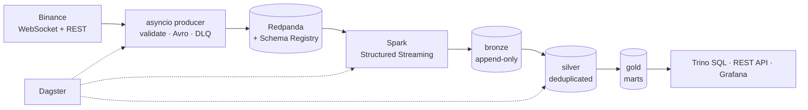

<h1 align="center">MarketPulse</h1>

<p align="center">
  <em>A real-time crypto market-data lakehouse.</em><br/>
  Kafka → Apache Iceberg → dbt → Trino, orchestrated with Dagster.
</p>

<p align="center">
  <a href="#quick-start">Quick start</a> ·
  <a href="docs/architecture.md">Architecture</a> ·
  <a href="docs/adr/">Decisions</a> ·
  <a href="docs/runbook.md">Runbook</a> ·
  <a href="README.es.md">Resumen en español</a>
</p>

---

## What it does

MarketPulse consumes the public Binance market-data feed continuously — every
trade and every change to the top of the order book — validates it against a
versioned contract, lands it in an Iceberg lakehouse on object storage,
transforms it through a medallion model with dbt, and serves it over SQL and
HTTP. It also ingests the official Colombian TRM so every figure can be read in
COP as well as USD.

It is built to be *operated*, not just to run: every stage has a place for bad
data to go, every silent failure mode has a metric, and the platform publishes
a per-instrument-per-day verdict on the quality of its own output.



---

## Quick start

Requires Docker with roughly 10 GB of memory available, and Python 3.11+.

```bash
git clone <this-repo> && cd marketpulse
make init          # virtualenv, dependencies, git hooks
make up            # broker, object storage, Iceberg catalog
make bootstrap     # topics, schemas, Iceberg tables
make up-all        # Spark, Trino, Dagster, Grafana, the producer
make urls          # where everything is
```

Within a minute or two of `make up-all`, live trades are landing. Confirm:

```bash
make sql
```
```sql
select symbol, count(*) as trades, max(trade_time) as latest
from lakehouse.bronze.trades
group by 1 order by 2 desc;
```

Then build the warehouse and look at the output:

```bash
make dbt-build
```
```sql
select symbol, bar_start, close_price, vwap,
       order_flow_imbalance, time_weighted_spread_bps
from lakehouse.gold.fct_market_1m
where symbol = 'BTCUSDT'
order by bar_start desc
limit 20;
```

No API keys are needed. The feed is Binance's public read-only market-data
mirror; the platform never places an order and has no credentials that could.

---

## Why it is built this way

The interesting content of this repository is not that the pieces connect —
it is the handful of decisions that are easy to get wrong and expensive to
discover late. Each is recorded in an [ADR](docs/adr/) with the alternatives
that were rejected.

**A market-data socket fails by staying open, not by closing.** TCP will not
notice, and neither will a message-rate alert — an idle socket reports a
perfectly healthy zero. So every read is wrapped in an idle watchdog, and the
alert fires on *time since the last message* rather than on a rate. Because
crypto trades continuously, a quiet feed is always a fault and never a weekend,
which is what makes that rule safe to page on.

**Some data loss is reported as success by every component involved.** The
venue's `update_id` is monotonic per symbol; a gap means updates were sent that
we never received — while the socket was fine, the producer succeeded, Kafka
acknowledged and Spark committed. A sequence tracker turns that into a counter
and carries it all the way into the warehouse.

**Exactly-once is not worth what it costs here.** The platform is
at-least-once end to end with deterministic natural keys, and deduplication is
pushed into the silver layer. Every component can then be restarted, replayed
or backfilled without coordinating with any other — which is worth more than
the label. The duplicate rate is measured rather than assumed.

**Checking your data against itself proves nothing.** A dropped trade is
perfectly self-consistent: the counts agree, the sums add up, uniqueness holds.
So the platform reconciles its own trade-derived candles against the venue's
independently published ones. That comparison is the only thing in the system
capable of catching a dropped trade, a double-counted one, or a trade binned
into the wrong minute.

**Averaging a spread across quote updates is biased, not merely imprecise.**
Quotes tighten in bursts of many rapid updates and widen into long quiet
stretches, so weighting every update equally over-represents exactly the moments
when liquidity was best. The platform records how long each quote was the
prevailing top of book and weights by that. Both numbers are kept, because the
gap between them measures how uneven the quote rate was.

**An overlapping interval table silently multiplies rows.** The TRM is
published as a validity interval — Friday's rate stays in force through the
weekend — so the currency conversion is a range join. The upper bound is
recomputed from the next publication rather than trusted from the source,
because an overlap presents downstream as a number being 1.3× too high:
plausible enough to be believed, subtle enough to take a week to trace.

**Data quality has to be answerable months later.** Prometheus answers "is it
broken now" with fifteen days of retention. The question that actually gets
asked is "was the third of March any good", long afterwards, when someone
questions a number. `mart_pipeline_health` derives one verdict per
instrument-day from the data itself, so it survives a monitoring wipe or a
change of vendor.

[**→ The full tour, with pointers to the code**](docs/architecture.md#5-where-the-interesting-problems-are)

---

## The stack, and why each piece

| Layer | Choice | Why this one |
|---|---|---|
| Broker | **Redpanda** (Kafka API) | Kafka semantics with a built-in Schema Registry and one process instead of three. Swappable for Kafka without a code change. |
| Table format | **Apache Iceberg** | Atomic commits, schema and partition evolution, snapshot expiry as a retention primitive, and four engines reading one catalog. [ADR-0002](docs/adr/0002-table-format-apache-iceberg.md) |
| Catalog | **REST**, JDBC-backed on Postgres | The REST spec makes Polaris, Lakekeeper, Nessie or Glue a config change rather than a migration. |
| Streaming | **Spark Structured Streaming** | The bronze hop is stateless, so Flink's operational cost buys nothing today. The Kafka topics are the seam that makes swapping to it cheap when it does. [ADR-0004](docs/adr/0004-streaming-engine-spark-structured-streaming.md) |
| Transformation | **dbt on Trino** | Version-controlled, tested, documented SQL, and Trino reads the same Iceberg snapshot Spark writes. |
| Orchestration | **Dagster** | Orchestrates *data*, not tasks: partition-aware backfill is a UI selection, and dbt's DAG and the platform's DAG become one graph. [ADR-0005](docs/adr/0005-dagster-over-airflow.md) |
| Storage | **MinIO** locally, S3 in production | Identical API; the difference is a URL. |
| Observability | **Prometheus + Grafana** | Alert rules that page on the failures that are otherwise invisible. |

---

## Repository layout

```
marketpulse/
├── src/marketpulse/
│   ├── contracts/          Avro schemas + pydantic models + the wire codec
│   ├── ingestion/          websocket feed, REST backfill, publisher, CLI
│   ├── streaming/          Spark Kafka→Iceberg jobs and the bronze DDL
│   ├── maintenance/        PyIceberg compaction and snapshot expiry
│   ├── serving/            read-only FastAPI over the gold marts
│   ├── config.py           every environment variable, read once
│   └── observability.py    Prometheus instrumentation
├── dbt/marketpulse/        staging → silver → gold, with tests and macros
├── orchestration/          Dagster assets, checks, schedules, sensors
├── docker/                 Dockerfiles and service configuration
├── tests/                  unit (hermetic) and integration (needs the stack)
├── docs/                   architecture, ADRs, runbook
└── docker-compose.yml      the whole platform, in profiles
```

---

## Working on it

```bash
make check              # lint + types + unit tests: exactly what CI runs
make test               # hermetic unit tests only
make test-integration   # needs `make up`; skips cleanly without it
make dbt-build          # models, snapshots, seeds and tests
make dbt-docs           # the generated data catalogue
make maintenance        # Iceberg compaction and snapshot expiry
make dlq                # what the pipeline is currently rejecting
```

The unit suite is fully hermetic — no broker, no network, no containers — and
runs in a few seconds. The test doubles in `tests/unit/fakes.py` are
hand-written rather than mocks, because they encode what the real dependency
actually does (librdkafka raises `BufferError` when its queue is full) and a
`MagicMock` encodes nothing at all.

**Contract changes** go through `marketpulse schemas check`, which CI runs
against the registry. A schema that would break an existing reader fails the
pull request, which is the only point at which that is still cheap to fix. See
[ADR-0006](docs/adr/0006-schema-evolution-and-data-contracts.md).

---

## Honest limitations

A local stack that pretends to be production-ready is worse than one that is
clear about the gap.

- **Single-node everything.** One broker, one MinIO, one Trino. Replication
  factor 1 means the local lake has no redundancy.
- **No authentication.** Trino, Dagster and the API are open on localhost. A
  real deployment needs OIDC and per-layer grants, with consumers granted
  `gold` only.
- **~1 minute end-to-end latency to bronze**, by design: a 60-second streaming
  trigger is what keeps Parquet files at a workable size. This is an analytics
  platform, not an execution system.
- **Order-book depth is top-of-book only.** Full depth reconstruction needs a
  stateful stream processor; the Kafka topics are the seam where Flink would
  slot in.
- **Backfill depth is bounded by the venue.** Roughly a year of 1-minute
  candles is available over REST; there is no historical source for book
  updates at all, so a gap in quote data is permanent.

[The production gap, itemised](docs/architecture.md#7-what-this-would-need-to-run-in-production)

---

## Licence

MIT. See [LICENSE](LICENSE).
