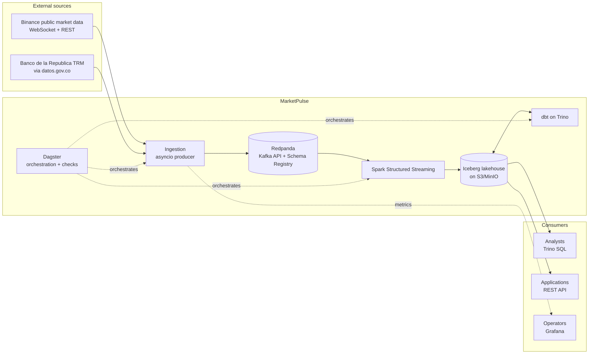
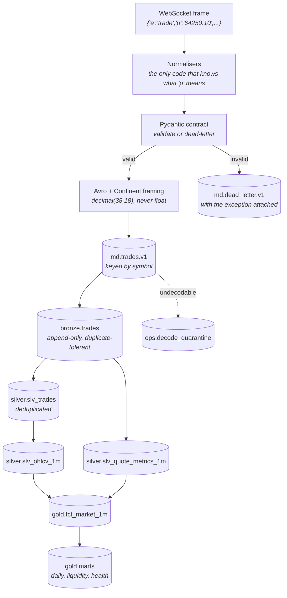
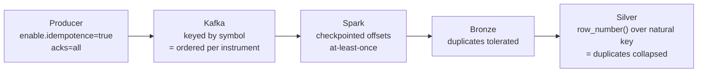
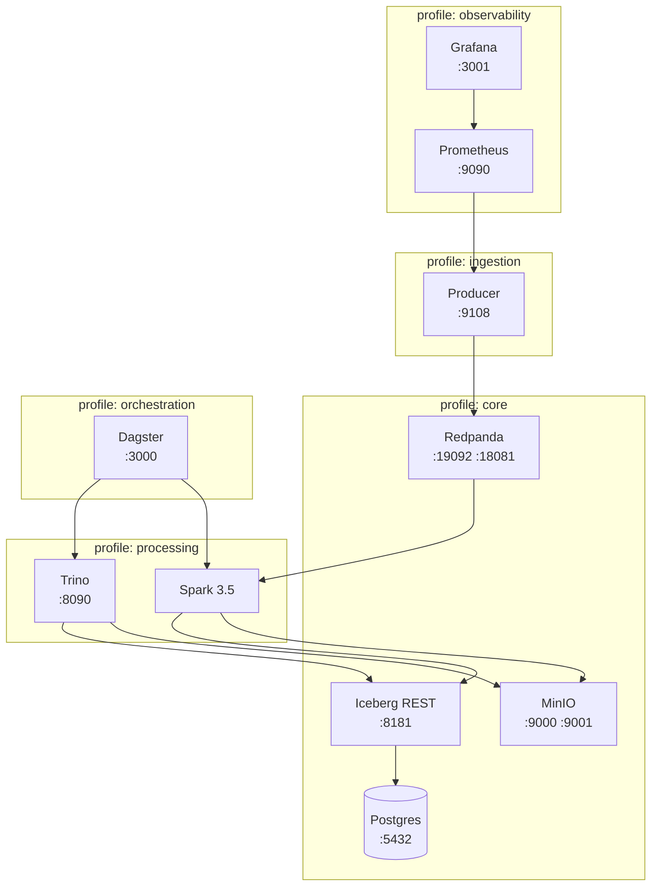

# Architecture

MarketPulse ingests public crypto market data continuously, lands it in an
Apache Iceberg lakehouse, transforms it through a medallion model, and serves
it over SQL and HTTP. This document explains how the pieces fit and, more
usefully, why each boundary sits where it does. The decisions themselves are
recorded in [`docs/adr/`](adr/); this is the map.

---

## 1. System context

The platform owns nothing upstream of `ingest` and everything downstream of it.
That is the first architectural fact worth internalising: the venue is a
third party that changes its payloads without notice, so every boundary near it
is defensive.

---

## 2. Data flow, end to end

Two things to notice.

**Bad data has somewhere to go at every stage.** A payload that fails
validation goes to the dead-letter topic; a message that fails Avro decoding
goes to the quarantine table. Neither stops the pipeline, and both are
queryable afterwards. A pipeline whose only failure mode is stopping is a
pipeline that will be stopped a lot.

**Bronze is the replay buffer.** Kafka retention is days; bronze retention is
years. Every silver and gold table is reconstructible from bronze alone, which
means "reprocess the last month" is a `dbt build --full-refresh`, not a
negotiation with a rate limiter.

---

## 3. The layers

| Layer | Materialised by | Rule | Retention |
|---|---|---|---|
| **Kafka topics** | asyncio producer | Contract-validated, Avro, keyed by symbol | 7 days |
| **Bronze** | Spark Structured Streaming | Append-only, no business logic, raw payload preserved | Years |
| **Silver** | dbt incremental | Deduplicated, conformed, UTC, one row per real event | Years |
| **Gold** | dbt table / incremental | Consumer-facing marts and the dimensional model | Years |

The rule per layer is enforced, not suggested:

- Staging models are **ephemeral**, so nothing can materialise and be read in
  place of silver by accident.
- A singular test walks the compiled manifest and fails if any gold model
  depends on a bronze source. Bronze is duplicate-tolerant by design, so a gold
  model reading it would double-count with every other test still green.

See [ADR-0003](adr/0003-medallion-layering.md).

---

## 4. Delivery semantics

At-least-once end to end, with idempotent natural keys, and deduplication
pushed into silver. Chasing exactly-once across three systems costs more than
it buys; see [ADR-0007](adr/0007-exactly-once-and-idempotency.md).

Every component in that chain can be restarted, replayed or backfilled without
coordinating with any other one. That property is the whole point, and it is
worth more than the exactly-once label.

The duplicate rate is not a mystery: `slv_trades._duplicate_count` records how
many bronze rows each trade appeared as, and `mart_pipeline_health.duplicate_ratio`
aggregates it per instrument-day.

---

## 5. Where the interesting problems are

A tour of the decisions that are not obvious, each with a pointer to the code.

### The socket that stays open and says nothing

The common market-data failure is not a socket that closes — it is a socket
that stays established and stops delivering. TCP will not notice. Neither will
`async for message in ws`. Neither will a message-rate alert, which reports a
perfectly healthy zero.

Two mechanisms address it: an idle watchdog wrapping every read
(`ingestion/binance_ws.py`), and an alert on `time() - last_message_unixtime`
rather than on a rate (`docker/prometheus/alerts.yml`). Crypto venues trade
continuously, so a quiet feed is always a fault and never a weekend — which is
what makes that rule safe to page on.

### Loss that every component reports as success

The venue's `update_id` is monotonic per symbol. A gap means updates the venue
sent that we never received. Nothing else in the stack can see this: the
socket is fine, the producer succeeded, Kafka acknowledged, Spark committed.
`SequenceTracker` (`ingestion/normalizers.py`) turns it into a counter, and
`slv_quote_metrics_1m.missed_updates` carries it into the warehouse.

### Money is not a physics problem

Prices are `decimal(38,18)` from the websocket frame to the gold mart, and
parsing goes `str → Decimal`, never through `float`. `Decimal(float("0.1"))` is
`0.1000000000000000055511151231257827`, and reconciliation against the venue's
own candles has to match to the last digit.
`assert_trade_prices_respect_tick_size` is the end-to-end proof that this held:
a price off the venue's price grid is a parsing bug, not a market event.

### Averaging a spread over updates is biased, not just imprecise

Quotes tighten in bursts of many rapid updates and widen into long quiet
stretches. Averaging `spread_bps` across updates therefore over-weights exactly
the moments when liquidity was best. `slv_quotes` computes how long each quote
was the prevailing top of book, and `slv_quote_metrics_1m` weights by that
duration. Both numbers are kept — the gap between them measures how uneven the
quote rate was.

### An overlapping interval table multiplies rows

The TRM is published as a validity interval, not a daily point: a Friday rate
stays in force through the weekend. `slv_fx_rates` recomputes `valid_to` from
the *next* publication rather than trusting the source's own upper bound,
because the publisher occasionally emits an overlap after a correction. An
overlapping interval silently multiplies rows in every range join that touches
it, which presents as a number being 1.3× too high — plausible enough to be
believed, subtle enough to take a week to trace.
`assert_no_overlapping_fx_intervals` is the tripwire.

### Checking your data against itself proves nothing

Every quality test in a typical warehouse compares the data to expectations
derived from the same data. A dropped trade satisfies all of them: the row
counts are consistent, the sums add up, the uniqueness holds.

`fct_kline_reconciliation` compares our trade-derived candles against the
venue's independently published ones. It is the only assertion in the platform
capable of catching a dropped trade, a double-counted one, or a trade binned
into the wrong minute.

### Quality has to be answerable months later

Prometheus answers "is it broken now" with fifteen days of retention. The
question actually asked is "was the third of March any good", months later,
when someone questions a number. `mart_pipeline_health` derives one verdict per
instrument-day from the data itself, so it survives a monitoring wipe, a
producer redeploy, and a change of vendor.

### Iceberg maintenance is a workload, not a chore

A 60-second streaming trigger produces 1,440 commits per table per day. Query
planning cost is dominated by file count, so an unmaintained table does not
fail — it gets slower, gradually, until someone concludes the lakehouse was a
mistake. Maintenance runs nightly in a fixed order: **compact, then expire, then
remove orphans**. Expiry before compaction is the classic mistake and is a
no-op, because the files compaction is about to orphan are still referenced by
the live snapshot.

---

## 6. Physical deployment (local)

Profiles exist so a laptop does not have to run all of it. `make up` starts
core; `make up-all` starts everything.

Two failure modes this layout deliberately avoids:

- **Redpanda advertises two listeners with distinct addresses.** The advertised
  address is what a client reconnects to after metadata discovery, not the
  address it dialled, so a single-listener setup works from inside the network
  and mysteriously fails from the host.
- **Every dependency waits on `service_healthy`, not `service_started`.** Spark
  starting before the Iceberg catalog is reachable fails with an error that
  points at entirely the wrong component.

The Iceberg catalog is JDBC-backed on Postgres. It is the one piece of state
whose loss makes every table in the lake unreadable, so it lives in a database
on a volume like anything else that matters.

---

## 7. What this would need to run in production

Stated plainly, because a local stack that pretends to be production-ready is
worse than one that is honest about the gap.

| Concern | Local | Production |
|---|---|---|
| Broker | Single-node Redpanda | 3+ brokers, RF=3, `min.insync.replicas=2` |
| Object storage | MinIO, single node | S3 with lifecycle policies and versioning |
| Catalog | `iceberg-rest-fixture` on Postgres | Polaris, Lakekeeper or Glue, with backups |
| Compute | One Spark container | Autoscaling cluster, or Flink if latency requirements tighten |
| Secrets | `.env` | A secret manager; nothing in the image |
| Auth | None | OIDC on Trino and Dagster, per-layer grants; consumers granted `gold` only |
| Lineage | Dagster's asset graph | OpenLineage events to Marquez or DataHub |
| Alerting | Prometheus rules, logged | Routed to a real on-call rotation |

The seams that make those swaps cheap are deliberate: the Iceberg **REST** spec
means the catalog is replaceable without touching engine configuration, and the
Kafka topics mean the streaming engine is replaceable without touching either
the producer or the warehouse.

---

## 8. Reading the code

Suggested order for a first pass:

1. `docs/adr/` — the decisions, with the rejected alternatives.
2. `src/marketpulse/contracts/` — the schemas and the models. Everything else
   is downstream of these.
3. `src/marketpulse/ingestion/binance_ws.py` — the reconnect state machine.
4. `dbt/marketpulse/models/silver/slv_quote_metrics_1m.sql` — the measurement
   worth arguing about.
5. `dbt/marketpulse/models/gold/fct_kline_reconciliation.sql` — the only test
   that can catch what the others cannot.
6. `docs/runbook.md` — what to do when it breaks.
